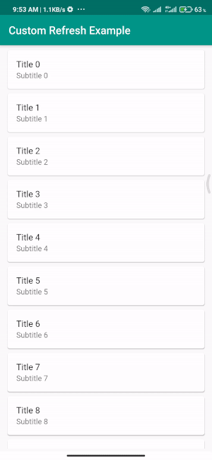

# CUSTOM PULL TO REFRESH EXAMPLE



## Code :
```
CustomRefreshIndicator(
  onRefresh: () => Future.delayed(Duration(seconds: 5), () {
    Fluttertoast.showToast(msg: "Refresh Completed");
  }),
  offsetToArmed: _offsetToArmed,
  child: ...(
    ....
  ),
  builder: (
    BuildContext context,
    Widget child,
    IndicatorController controller,
  ) {
    return AnimatedBuilder(
      animation: controller,
      builder: (BuildContext context, _) {
        return Stack(
          alignment: Alignment.topCenter,
          children: [
            if (!controller.isIdle)
              Container(
                color: Colors.grey[200],
                height: _offsetToArmed * controller.value,
                width: double.infinity,
                child: SpinKitSquareCircle(
                  color: Colors.teal,
                ),
              ),
            Transform.translate(
              offset: Offset(0, _offsetToArmed * controller.value),
              child: AnimatedOpacity(
                opacity: controller.isIdle ? 1.0 : 0.0,
                duration: Duration(milliseconds: 450),
                child: child,
              ),
            ),
          ],
        );
      },
    );
  },
),
```

#### If you need more inspiration using custom refresh, check the 'custom-1' branch!

## Credits :
#### Packages : 
- custom_refresh_indicator 0.8.0+1 : https://pub.dev/packages/custom_refresh_indicator
- flutter_spinkit 4.1.2+1 : https://pub.dev/packages/flutter_spinkit
- fluttertoast 7.1.1 : https://pub.dev/packages/fluttertoast
